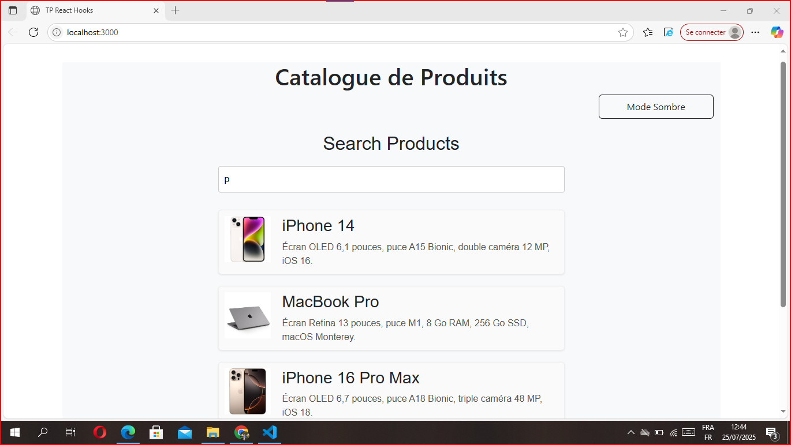
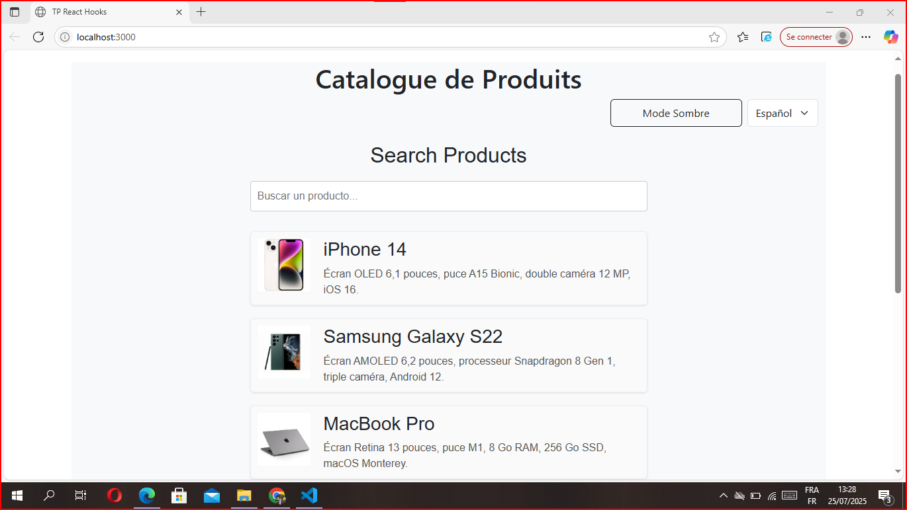
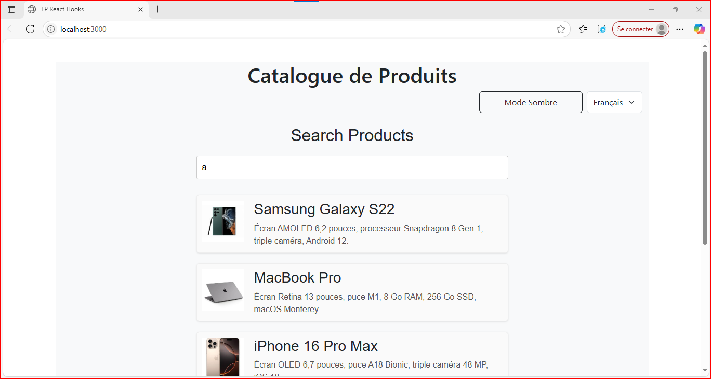
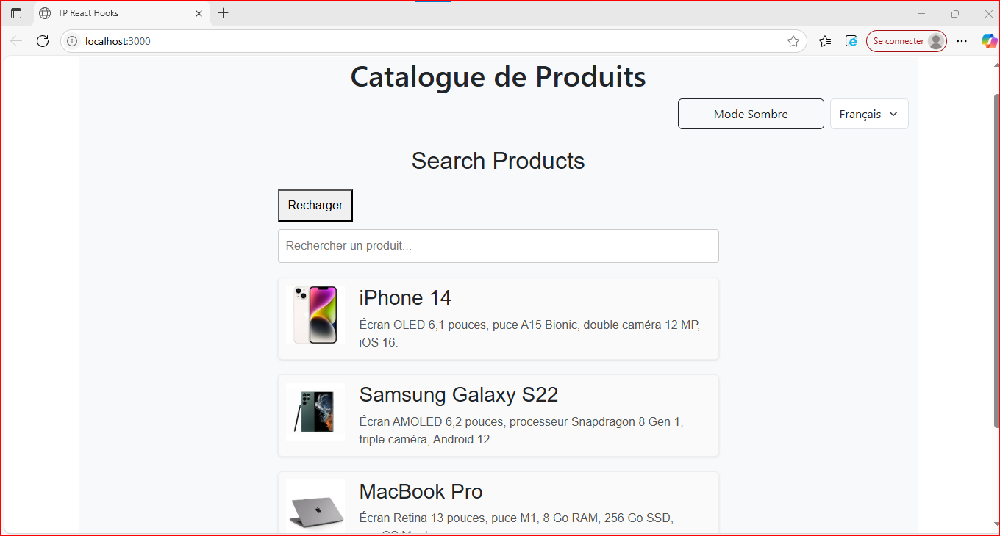
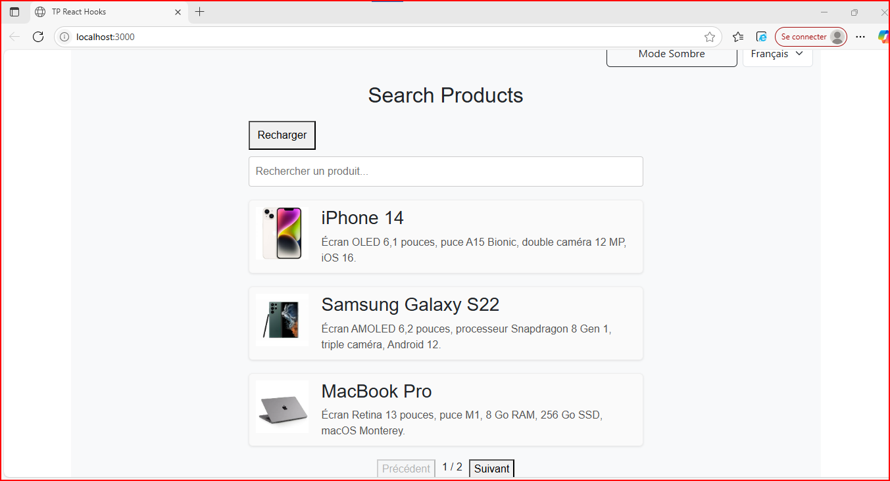
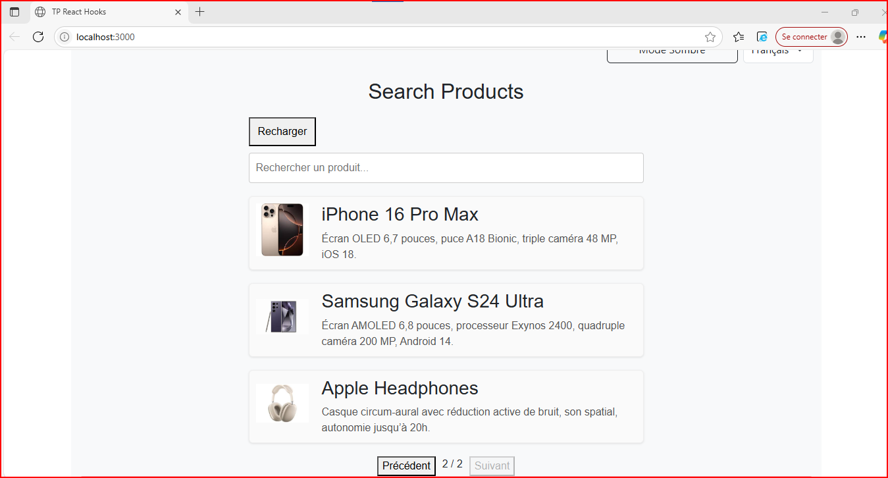

# TP React Hooks - Application de Gestion de Produits  

🔗 [Lien vers mon dépôt GitHub](https://github.com/ZAINABELARABI/TP-React-hooks)

---

## Objectif 

Ce TP a pour objectif de mettre en pratique l'utilisation des Hooks React (`useState`, `useEffect`, `useContext`) ainsi que la création de hooks personnalisés.

---

 Configuration
 ---------------
## Cloner le dépot

 'git clone https://github.com/pr-daaif/tp-react-hooks.git'
 'cd tp-react-hooks'

 ## Changement de remote

 'git remote remove origin'
 'git remote add origin https://github.com/ZAINABELARABI/TP-React-hooks'
 'git push -u origin main'

 ## Installation des dépendances

 'npm install'

 ## Lancement de l'application

 'npm start'

## Exercice 1 : État et Effets

🛠️ **1.1.Modification du composant productSearch**

Recherche en temps réel avec `useState` et `useEffect`.  
Filtrage dynamique des produits affichés selon le texte saisi.

  

🛠️ **1.2.Implémentation de debounce sur la recherche**

Pour éviter de lancer la recherche à chaque frappe au clavier, nous avons utilisé un **hook personnalisé `useDebounce`** qui attend un délai de 500ms avant de mettre à jour le terme recherché. Cela réduit les appels inutiles et améliore les performances.

Nous avons importé ce hook dans `ProductSearch.js` et remplacé l'utilisation directe de `searchTerm` dans le `useEffect` par `debouncedSearchTerm`.

  

## Exercice 2 : Context et Internationalisation 

 🛠️**2.1. Utilisation de `useContext` pour partager l'état de recherch**

Nous avons créé un contexte `SearchContext` pour partager l'état de recherche entre les
composants. Nous avons utilisé `useContext` pour accéder à cet état
dans `ProductSearch.js` et `ProductList.js`.

🛠️ **2.2. Ajout de sélecteur de langue (LanguageSelector.js)**

Nous avons créé un composant `LanguageSelector` qui utilise le contexte `LanguageContext`. Il affiche un menu déroulant avec les options : Français, Anglais et Espagnol.

🛠️ option English
 

🛠️ option Espagnol
  

## Exercice 3 : Hooks personnalisés

🛠️ **3.1. Hook UseDebounce**

Ce hook permet de "débouncer" une valeur, c’est-à-dire de ne mettre à jour cette valeur qu’après un certain délai sans changement. Cela évite par exemple de lancer une recherche à chaque frappe, mais seulement après que l’utilisateur ait fini de taper.

🛠️ **3.2. Hook LocalStorage**

Ce hook permet de conserver le dernier terme recherché même après un rafraîchissement, améliorant ainsi l’expérience utilisateur.

la page conserve "a" la dernière lettre saisie de recherche après son rechargement 
 

## Exercice 4 :  Gestion Asynchrone et Pagination

🛠️ **4.1. Ajout de boutton de rechergement**

Un bouton « Recharger » a été ajouté au-dessus du champ de recherche. Il permet :

**de réinitialiser le champ de recherche**
**de revenir automatiquement à la page 1**

 

🛠️ **4.2. Implémentation de la pagination**

La pagination permet d'afficher 3 produits par page : 

**Deux boutons « Précédent » et « Suivant » permettent de naviguer entre les pages**
**La pagination s’ajuste dynamiquement selon le résultat de la recherche**

Le bouton précédent est désactivé en page 1  

 

Le bouton suivant est désactivé en dernière page.

 