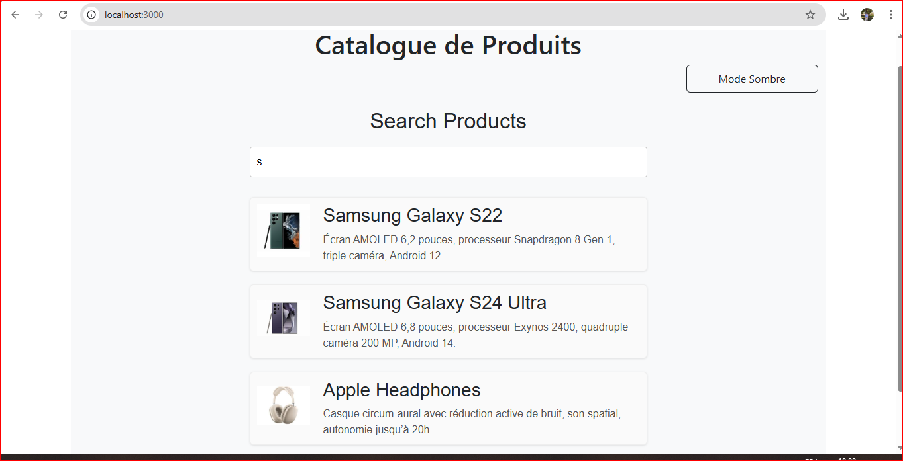

# TP React Hooks - Application de Gestion de Produits  
*Réalisé par Zineb EL ARABI*

🔗 [Lien vers mon dépôt GitHub](https://github.com/ZAINABELARABI/TP-React-hooks)

---

## Objectif

Ce TP a pour objectif de mettre en pratique l'utilisation des Hooks React (`useState`, `useEffect`, `useContext`) ainsi que la création de hooks personnalisés.

---

## Exercice 1 : État et Effets

🛠️ **Solution**

Recherche en temps réel avec `useState` et `useEffect`.  
Filtrage dynamique des produits affichés selon le texte saisi.

  